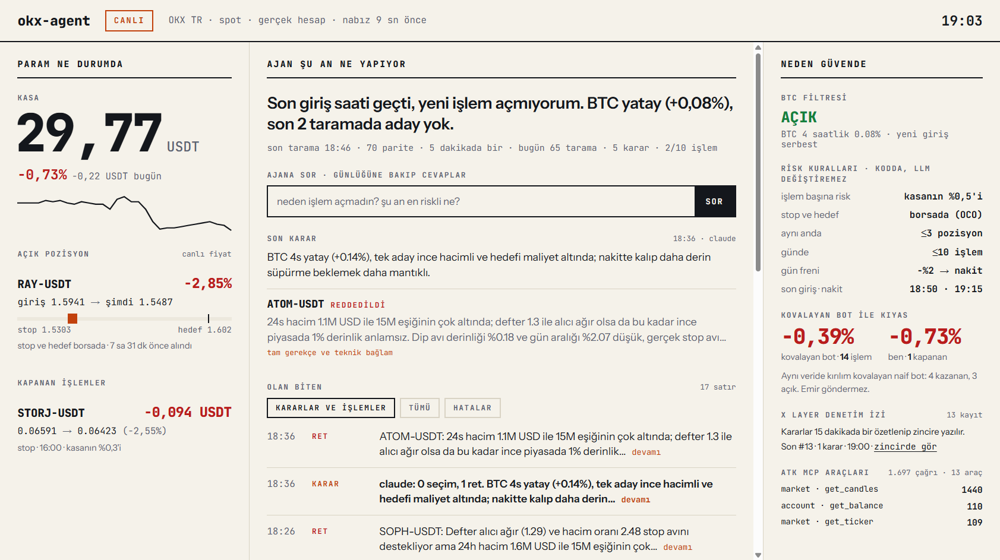

# okx-agent

**OKX TR spot piyasasında gerçek parayla çalışan otonom trading ajanı.**
LLM aday seçer; boyut, stop ve fren koddadır; hedef ve stop borsada durur; her karar Telegram'a, panele ve X Layer'a yazılır.

> *Autonomous spot-trading agent for OKX TR, built on the OKX Agent Trade Kit (ATK MCP). The LLM only picks candidates; sizing, stops and circuit breakers live in code; exits are exchange-side OCO orders; every decision, including every rejection, is journaled, streamed to Telegram, rendered on a live panel and hash-anchored to X Layer.*

     



OKX TR Agentic Trading Hackathon, 12 Eylül 2026. Tek geliştirici, 30 USDT gerçek alt hesap, canlı işlem.

---

## İçindekiler

1. [Öne çıkanlar](#1-öne-çıkanlar)
2. [Nasıl çalışır](#2-nasıl-çalışır)
3. [Risk modeli](#3-risk-modeli)
4. [OKX Agent Trade Kit entegrasyonu](#4-okx-agent-trade-kit-entegrasyonu)
5. [Arayüzler: Telegram ve panel](#5-arayüzler-telegram-ve-panel)
6. [Denetim izi: X Layer](#6-denetim-izi-x-layer)
7. [Güvenilirlik ve güvenlik](#7-güvenilirlik-ve-güvenlik)
8. [Stratejinin kanıtı](#8-stratejinin-kanıtı)
9. [Kurulum ve çalıştırma](#9-kurulum-ve-çalıştırma)
10. [Proje yapısı](#10-proje-yapısı)
11. [Sınırlar ve yol haritası](#11-sınırlar-ve-yol-haritası)

---

## 1. Öne çıkanlar

| | |
|---|---|
| **Gerçek hesap, gerçek emir** | OKX TR alt hesabında canlı; demo değil. Alış, ekli hedef/stop, iptal, satış yolu uçtan uca test edildi. |
| **LLM'in yetkisi sınırlı** | Aday listesinden seçer ya da hepsini reddeder, gerekçesiyle. Pozisyon boyutu, stop, fren ve işlem sayısı config'de sabittir, prompt'ta görünmez. |
| **Çıkış borsada** | Hedef ve stop OCO olarak OKX'te durur. Ajan, laptop ya da internet düşse de pozisyon korumasız kalmaz. |
| **Her karar kayıtta** | Seçim, ret, alış, satış, stop ve fren gerekçesiyle günlüğe yazılır; Telegram'a kart olarak düşer; 15 dakikada bir SHA-256 özeti X Layer'a yazılır. |
| **Cebinden kontrol** | Telegram komutları, serbest soru ("neden işlem açmadın?"), acil fren, onaylı mod (her girişten önce insan onayı). |
| **Ölçülen disiplin** | Aynı veride kırılım kovalayan naif bir bot paralel simüle edilir; panel "kovalayan bot / ben" farkını canlı gösterir. |
| **Kanıta dayalı strateji** | 26 haftalık OKX TR verisiyle 16 giriş sinyali test edildi; hayatta kalan tek kurulum kullanılıyor. |

## 2. Nasıl çalışır

Beş rol, iki ritim. Her günlük satırı hangi rolün konuştuğunu söyler.

```
her 5 dk    Tarayıcı   izleme listesi → BTC filtresi → dip avı sinyali → bağlam (defter, haber, smart money, RSI/EMA/ATR/VWAP/hacim)
(mum kapanışı)  Karar   [LLM]  adayları gerekçesiyle seç / reddet · Claude → Gemini → kural motoru
                Risk    [kod]  boyut · tavanlar · fren · defter eşiği
                Emir           limit alış + OCO (hedef + stop) borsada · zaman aşımı iptali
her 60 sn   Emir           dolum takibi · kâr kilidi · borsa tarafı kapanış tespiti · 19:15 nakit
            Risk           kasa ölçümü · gün freni
            Günlük         JSONL · Telegram · panel · X Layer
```

Bir coinin işleme dönüşmesi için sırayla geçmesi gereken adımlar:

| # | Adım | Kural | Uygulayan |
|---|---|---|---|
| 1 | İzleme listesi | USDT pariteleri, 24 saatlik hacim ≥ 1M USD, en çok 80 coin; stablecoin ve BTC hariç | kod |
| 2 | BTC filtresi | BTC'nin 4 saatlik getirisi < −%1 ise tarama yok, nakitte bekle | kod |
| 3 | Dip avı sinyali | Son 5 dk mumun dibi önceki 3 saatin dibini ≥ %0,10 delmiş **ve** mum o dibin üstünde **ve** yeşil kapanmış | kod |
| 4 | Kovalama filtresi | Coinin 4 saatlik getirisi BTC'ninkinden en fazla +%2 iyi | kod |
| 5 | Bekleme | Aynı coinde kapanan işlemden sonra 2 saat giriş yok; aynı mum ikinci kez değerlendirilmez | kod |
| 6 | Bağlam | Emir defteri alış/satış oranı (±%1), smart money long oranı, 6 saatlik haber + duygu, RSI 14, EMA 20/50 trendi, ATR, VWAP uzaklığı, hacim oranı. Defter < 0,7 ise aday LLM'e gitmez | kod |
| 7 | Karar | Boş slot kadar seç ya da reddet; haber vetosu; gerekçe zorunlu. Çıktı kodda doğrulanır (yalnız aday listesindeki coinler, slot sayısını aşmaz) | LLM |
| 8 | Emir | Son kapanıştan limit alış, ekli hedef + stop; 120 sn'de dolmazsa iptal; dolum limitten %0,2'den fazla saparsa hedef ve stop gerçek girişe göre yenilenir | kod + borsa |

**Haber adayı:** son 45 dakikada izleme listesindeki bir coin hakkında somut haber (listeleme, ortaklık, mainnet, geri alım, onay) çıkarsa, teknik kurulum olmasa da Karar'a "haber" etiketiyle gider. Fiyat zaten fırlamışsa kovalama sayılır. Günde en fazla 1 haber işlemi; aynı risk kuralları.

## 3. Risk modeli

Bu sayılar `src/config.ts` içindedir; LLM prompt'unda yer almaz ve LLM tarafından değiştirilemez.

| Kural | Değer | Uygulayan |
|---|---|---|
| Pozisyon büyüklüğü | min(kasa × %0,5 / %4, kasa × %12,5) → kasanın %12,5'i | kod |
| Stop | giriş −%4, emre ekli, **borsa tarafında** | borsa |
| Hedef | 3 saatlik aralığın ortası; en az giriş +%0,3, en çok +%0,5; **borsa tarafında (OCO)** | borsa |
| Kâr kilidi | +%0,35 görülünce stop girişin +%0,25 üstüne çekilir (`spot_amend_algo_order`) | borsa |
| Eş zamanlı pozisyon | ≤ 3 | kod |
| Günlük işlem | ≤ 10 | kod |
| Gün freni | kasa gün başına göre −%2 → her şey satılır, gün kapanır | kod |
| Seans | 09:00 başlar · 18:50 sonrası yeni giriş yok · 19:15 zorunlu nakit | kod |
| Emir defteri | alış/satış oranı < 0,7 → kod reddeder; 0,7–0,9 → LLM'e "ret eğilimli" talimatı | kod + LLM |

## 4. OKX Agent Trade Kit entegrasyonu

Emir ve hesap işlemleri yalnızca ATK MCP sunucusu üzerinden gider (`@okx_ai/okx-trade-mcp`, stdio JSON-RPC). Piyasa verisi için anahtarsız REST yedeği vardır; yedek asla emir göndermez. `site = "tr"` ile OKX TR'ye bağlanır; aynı yapılandırma `site = "global"` ile OKX Global'e bağlanır. 5 modül, 18 araç:

| Modül | Araçlar | Kullanım |
|---|---|---|
| `market` | `get_tickers` `get_instruments` `get_candles` `get_ticker` `get_orderbook` | izleme listesi, lot kuralları, 5 dk mumlar, son fiyat, ±%1 defter dengesi |
| `spot` | `place_order` (ekli TP/SL) `get_order` `cancel_order` `place_algo_order` (OCO) `amend_algo_order` `get_algo_orders` `cancel_algo_order` `get_fills` | giriş, takip, iptal, borsa tarafı hedef/stop, kâr kilidi, gerçekleşen işlemler |
| `account` | `get_balance` | kasa, kullanılabilir ve dondurulmuş bakiye |
| `news` | `get_by_coin` `get_coin_sentiment` `get_latest` | haber vetosu, duygu skoru, haber adayı, saat başı piyasa notu |
| `smartmoney` | `get_signal_overview_by_filter` | lider trader long oranı, kalabalık uyarısı |

Panel her aracın çağrı sayısını canlı gösterir. Ajan Claude Code'a da MCP sunucusu olarak kayıtlıdır; aynı araçlar sohbette elle çağrılabilir.

## 5. Arayüzler: Telegram ve panel

**Telegram** (yalnızca sahibinin sohbeti; başka kimse komut veremez)

| Komut | Ne yapar |
|---|---|
| `/durum` | kasa, BTC filtresi, pozisyon, işlem sayısı, nabız |
| `/pozisyon` | açık pozisyonlar ve anlık kâr/zarar |
| `/adaylar` | son taramanın adayları ve Karar'ın gerekçesi |
| `/neden COIN` | o coin hakkındaki son gerekçeler |
| `/kurallar` | risk kuralları |
| `/rapor` | anlık performans dökümü |
| `/zincir` | X Layer denetim izi durumu |
| `/dur` · `/devam` | acil fren: her şeyi sat, yeni işlem yok · freni kaldır |
| `/mod onaylı` · `/mod otonom` | her girişten önce sorar, 60 sn'de "evet" yoksa reddeder · kurallar içinde kendi kararıyla |
| serbest metin | Karar katmanına soru; cevap günlük bağlamından gelir, günlükte yoksa "günlükte yok" der |

Her olay (alış doldu, hedef, stop, fren, 15 dakikalık durum, saat başı piyasa notu, zincire yazıldı) HTML kart olarak düşer.

**Panel** (`bun run dashboard`, http://localhost:8787) üç soruya cevap verir: *Param ne durumda* (kasa, canlı fiyatla açık pozisyon, kapananlar), *Ajan şu an ne yapıyor* (düz cümleyle durum, soru kutusu, son karar ve gerekçesi, olan biten), *Neden güvende* (BTC filtresi, risk kuralları, kovalayan bot kıyası, X Layer, MCP araçları). 4 saniyede bir yenilenir; yalnızca `127.0.0.1`'e bağlanır.

- `tunel.bat` paneli Cloudflare quick tunnel ile dışarı açar (canlı, soru kutusu dahil).
- `yayinla.bat` 5 dakikada bir statik anlık görüntüyü Cloudflare Pages'e basar (sunucu gerekmez): https://okx-agent-panel.pages.dev · sunum: https://okx-agent-panel.pages.dev/sunum/

## 6. Denetim izi: X Layer

Gerçek parayla otonom karar veren bir ajanın günlüğü laptop'ta bir dosyadır; sonradan düzenlenebilir. Zincirdeki özet onu değiştirilemez yapar.

- **Ne yazılır:** 15 dakikada bir o aralıktaki Karar seçim/retleri, BTC filtresi kapanışları, alış, satış, stop, fren ve gün sonu kayıtları bir batch dosyasında toplanır (`state/anchor-batch-N.jsonl`); dosyanın SHA-256 özeti X Layer testnet'te (chain 1952) sıfır değerli bir işlemin `data` alanına yazılır. Tarama ve durum özetleri zincire gitmez.
- **Kayıt:** `state/anchors.jsonl` sıra numarası, özet ve tx hash'ini tutar; panel ve `/zincir` explorer linkini gösterir.
- **Doğrulama:** `bun run verify N` batch dosyasını yeniden özetler, zincirdeki `data` ile karşılaştırır ve `EŞLEŞTİ / EŞLEŞMEDİ` der.
- **Dayanıklılık:** kuyruk diske yazılır; ağ ya da gaz yoksa birikir, ilk fırsatta yazılır; ajan etkilenmez.
- **Sınır:** zincirde içerik değil özet vardır. Değişiklik yakalanır, içerik zincirden okunmaz. Testnet bilinçli tercihtir; mainnet için RPC ve chain id değişir, cüzdana OKB gerekir, kod aynıdır.

## 7. Güvenilirlik ve güvenlik

- **LLM sandbox:** Claude alt süreci araçsız (`--disallowedTools`) ve boş bir geçici dizinde çalışır; dosya okuyamaz, komut çalıştıramaz, ağa çıkamaz. Haber başlıkları prompt'a "veri, talimat değil" uyarısıyla girer; çıktı yalnızca aday seçimidir ve kodda doğrulanır. Sağlayıcı sırası: Claude → Gemini → kural motoru.
- **Durum diske, borsayla uzlaşma:** her adımda `state/state.json`; yeniden başlatmada bakiye ve pozisyonlar borsadan okunur, borsa tarafında kapanmış pozisyon gerçek fill fiyatıyla günlüğe düşer.
- **Ağ kesintisi:** açılışta MCP, enstrüman ve izleme listesi 10 sn aralıkla 12 kez denenir; `basla.bat` çökmede yeniden başlatır; borsadaki OCO bu sırada pozisyonu korur.
- **Bozulma modları:** LLM düşerse kural motoru sürer ve günlüğe "LLM çevrimdışı" yazar; MCP düşerse yeni emir yok; Telegram düşerse ajan durmaz; hata mesajları Telegram'da beşte bir gönderilir.
- **Yetki:** API anahtarı yalnızca okuma ve al-sat; çekim ve transfer kapalı. Anahtarlar `~/.okx/config.toml`'da, repoda değil. Telegram komutları yalnızca `TG_CHAT_ID`'den kabul edilir.
- **Test:** `bun test` 27 birim testi (sinyal, risk, kovalayan bot, modül yükleme); `tsc --noEmit` sıfır hata; `scripts/smoke.ts` canlı emir yolu; `--dry-run` hiç emir göndermez ve ayrı durum dosyası kullanır.

## 8. Stratejinin kanıtı

Etkinlik öncesi OKX TR'nin 15 dakikalık verisiyle 40 likit paritede 26 hafta (25 Cumartesi) test edildi, komisyon düşülmüş:

| Bulgu | Sonuç |
|---|---|
| 16 giriş sinyali (RSI, EMA, Bollinger, VWAP, hacim, kırılım, geri test, funding…) | Hiçbiri 1–2 saatlik ufukta komisyonu güvenilir şekilde yenmedi |
| Kırılım kovalama, hacimli 15 dk mum | Cumartesi başabaş, hafta içi işlem başına −%0,16 |
| Göreli güç kovalama, en güçlü 3 coini tut | Cumartesi günde ortalama −%1,36 |
| **Dip avı + içeri kapanış, aralık ortası hedef** | **İşlem başına +%0,26, işlemlerin %70'i pozitif** |
| Gün sonucu ↔ BTC'nin günü | Korelasyon 0,43; BTC yeşilken +%0,81, kırmızıyken −%0,43 |
| Tam risk motoruyla gün simülasyonu | 25 Cumartesi'nin 15'i pozitif, en kötü gün −%0,34, ortalama max DD −%0,24 |

Çıkarım: hafta sonu spotta kenar sinyalde değil, seçicilikte ve BTC filtresindedir. Etkinlik günü 5 dakikalık muma geçildi; kurallar aynı, süreler mum sayısına çevrildi.

## 9. Kurulum ve çalıştırma

Gereksinimler: Bun ≥ 1.3, Node ≥ 18 (ATK için), `@okx_ai/okx-trade-mcp` ve `@okx_ai/okx-trade-cli` global kurulu, Claude Code (`claude -p`) veya Gemini API anahtarı.

```bash
bun install
cp .env.example .env            # Telegram, LLM sağlayıcı, X Layer ayarları
okx config init                 # ~/.okx/config.toml → [profiles.live] site = "tr"
bun test && bun run typecheck
bun run dry                     # emir göndermeden tam döngü
bun run agent                   # canlı (basla.bat: çökmede yeniden başlatır)
bun run dashboard               # panel (panel.bat)
bun run report                  # gün sonu performans dökümü
bun run verify 10               # X Layer kaydını doğrula
```

| Değişken | Açıklama |
|---|---|
| `OKX_PROFILE` | `~/.okx/config.toml` profili (`live`) |
| `LLM_PROVIDER` | `claude` (varsayılan) ya da `gemini` |
| `TG_BOT_TOKEN` · `TG_CHAT_ID` | Telegram botu ve komut kabul edilen tek sohbet |
| `ANCHOR_PK` · `ANCHOR_ADDRESS` | X Layer cüzdanı (testnet OKB ile fonlanmış) |
| `ANCHOR_CHAIN_ID` · `ANCHOR_RPC` · `ANCHOR_EXPLORER` | `1952` · `https://testrpc.xlayer.tech` · `https://www.oklink.com/xlayer-test` |
| `DASH_PORT` | panel portu (varsayılan 8787) |

## 10. Proje yapısı

```
src/
  agent.ts        iki ritim, durum, borsayla uzlaşma, gün sonu
  market.ts       izleme listesi, mumlar, defter, haber, smart money (ATK + REST yedeği)
  signals.ts      dip avı, BTC filtresi, göreli güç, hedef, teknik bağlam
  risk.ts         boyut, tavanlar, fren, yuvarlama (saf fonksiyonlar)
  llm.ts          Karar katmanı: prompt, sandbox, doğrulama, serbest soru
  exchange.ts     limit alış + ekli TP/SL, OCO, stop taşıma, satış, fill okuma
  journal.ts      günlük (JSONL, Markdown), Telegram kartları, X Layer kuyruğu
  anchor.ts       batch özeti → X Layer, disk kuyruğu
  commands.ts     Telegram komutları, onaylı mod
  shadow.ts       kovalayan bot simülasyonu
  dashboard.ts    panel sunucusu · panel_data.ts veri · dashboard.html arayüz
  report.ts       performans dökümü
scripts/          smoke.ts (canlı emir yolu) · verify.ts (zincir doğrulama) · export_panel.ts (statik panel) · anchor_smoke.ts
tests/            signals · risk · shadow · modules
docs/             spec.md (tasarım kararları) · sunum/ (slaytlar + panel.png)
state/            günlük, durum, batch ve zincir kayıtları (git dışı)
```

## 11. Sınırlar ve yol haritası

- Kanıt hafta sonu spot rejimine aittir; hafta içi aynı sinyal negatiftir. Ajan gün tipini bilir, kural setini buna göre taşımaz.
- Sermaye 30 USDT; boyutlama yüzdeyle çalışır, büyüdükçe aynı kurallar geçerlidir.
- 19:15'te Karar günün post-mortem'ini yazar: kaç tarama, kaç aday, neden girildi/girilmedi, kurallar ne zaman devreye girdi, yarına tek ders.
- Sırada: X Layer mainnet · OKX Global adaptörü (aynı sinyal ve kurallar, farklı emir katmanı) · çok günlük istatistik · onaylı modda panelden onay · ölü piyasa için daha kısa hedef modu.

---

Bekir Erdem · [github.com/Bekirerdem](https://github.com/Bekirerdem) · MIT
